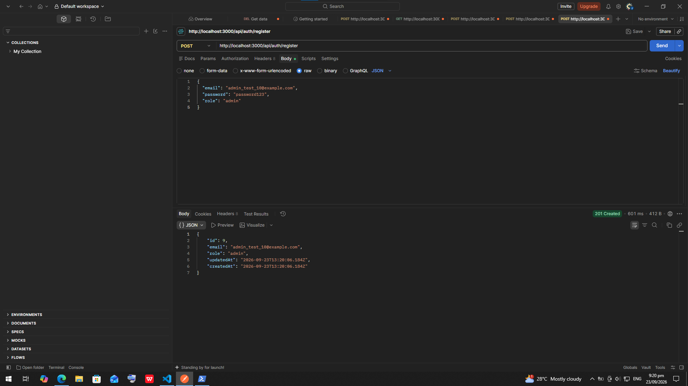
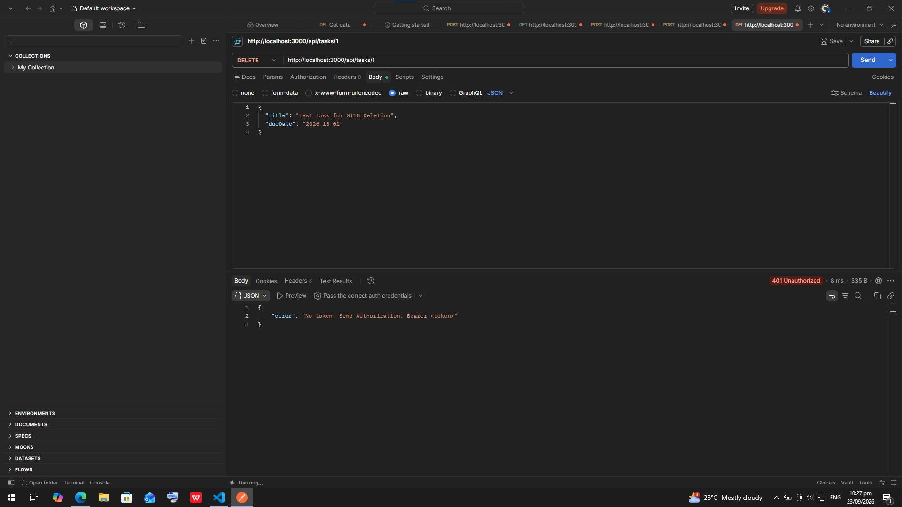
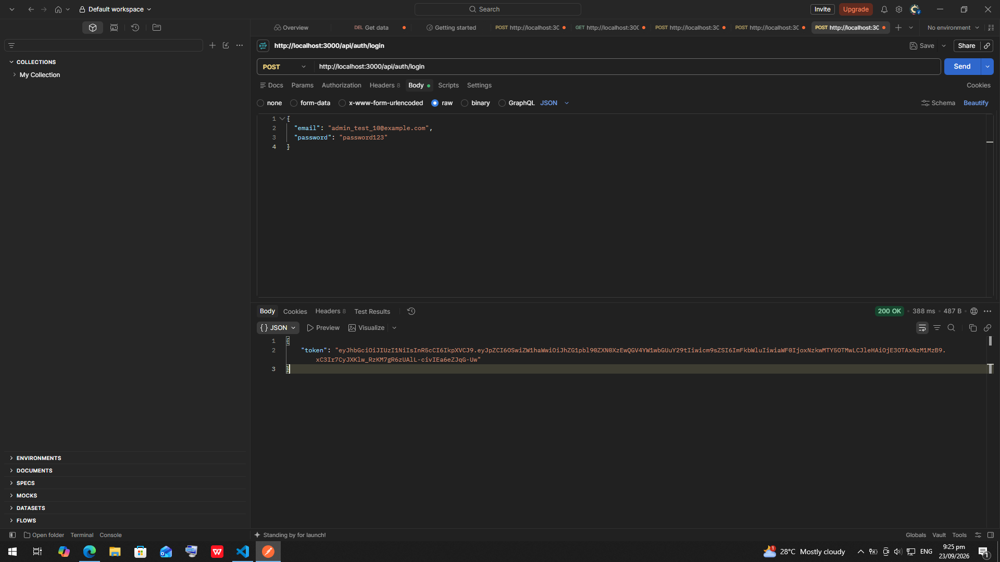

# itelect2-project
My IT Elective 2 backend web development project.

## API Testing

## Module4_Session8 Screenshots

## Module4_Session9 Screenshots

.png)
.png)
.png)

## Module5_Session10: Role-Based Authorization

### Implemented Functionality
- Extended registration logic (`POST /api/auth/register`) to accept a `role` field (`member` or `admin`).
- Updated `User` model (`models/user.cjs`) to support the `role` attribute with default value `'member'`.
- Applied authorization middleware to protect the `DELETE /api/tasks/:id` endpoint so that only users with `role: "admin"` can perform deletions.

### Test Verification Results

| Test Case | Method & Endpoint | Auth Header / Role | Expected Status | Result |
| :--- | :--- | :--- | :--- | :--- |
| **Test Case 1** | `DELETE /api/tasks/:id` | No Token | `401 Unauthorized` | PASSED |

| **Test Case 2** | `DELETE /api/tasks/:id` | Bearer Token (`member`) | `403 Forbidden` | PASSED |

| **Test Case 3** | `DELETE /api/tasks/:id` | Bearer Token (`admin`) | `200 OK` / `204 No Content` | PASSED |

